---
puppeteer:
  format: 'A4'
  margin:
    top: '1cm'
    right: '1cm'
    bottom: '1cm'
    left: '1cm'
  landscape: false
---

# Математика Задачі 2 курс 1 семестр

## Основні поняття, аксіоми стереометрії та найпростіші наслідки з них

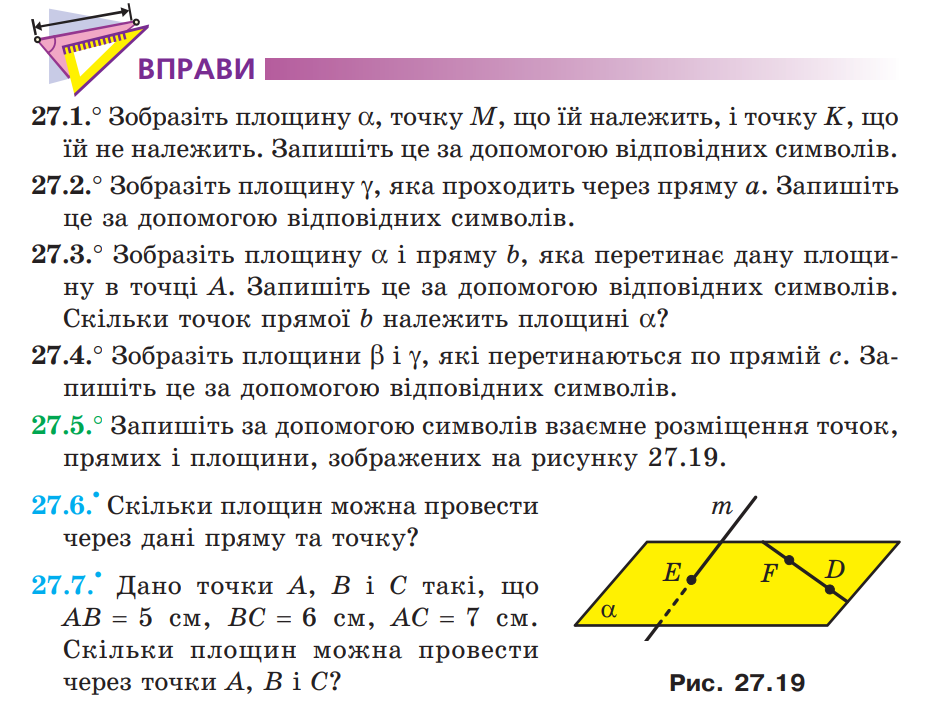

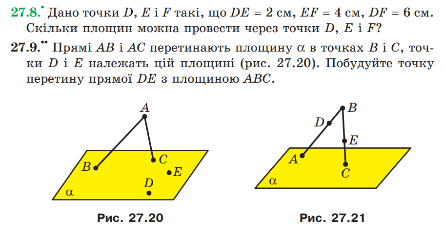

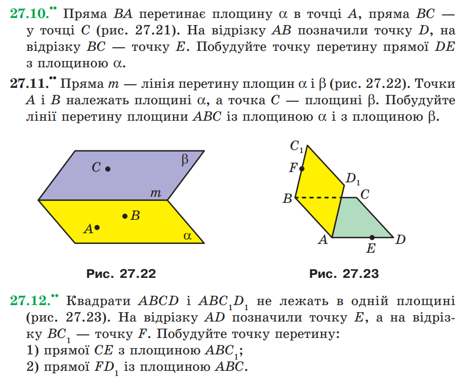

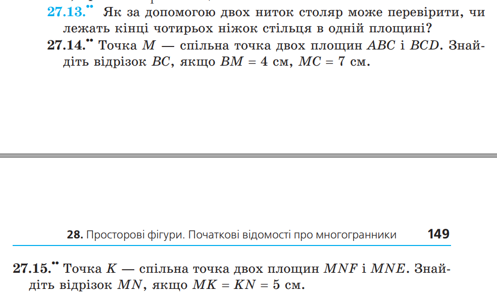

## Взаємне розміщення прямих у просторі. Паралельність прямої та площини. Паралельність площин

### Взаємне розміщення двох прямих у просторі

Задачі: 29.3, 29.4

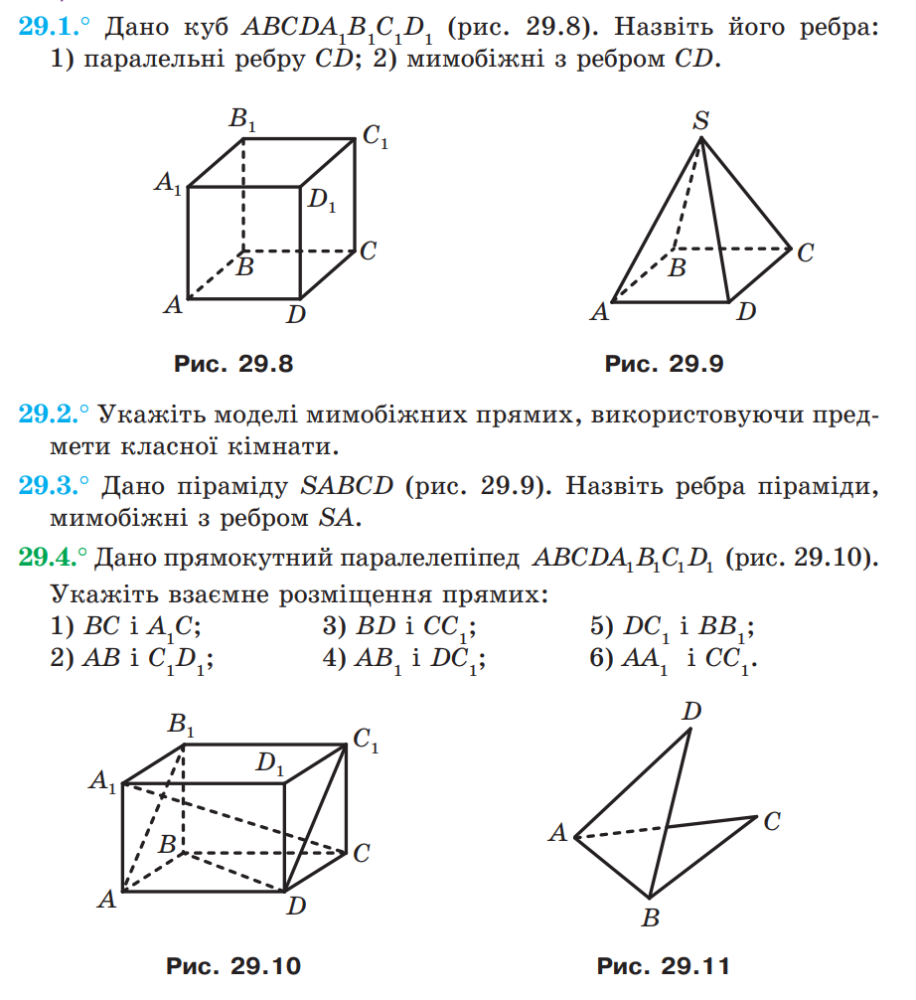

Задачі: 29.6

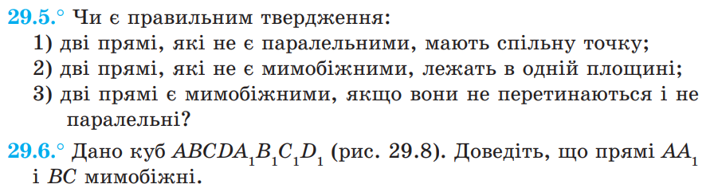

Задачі: 29.7 - 29.13

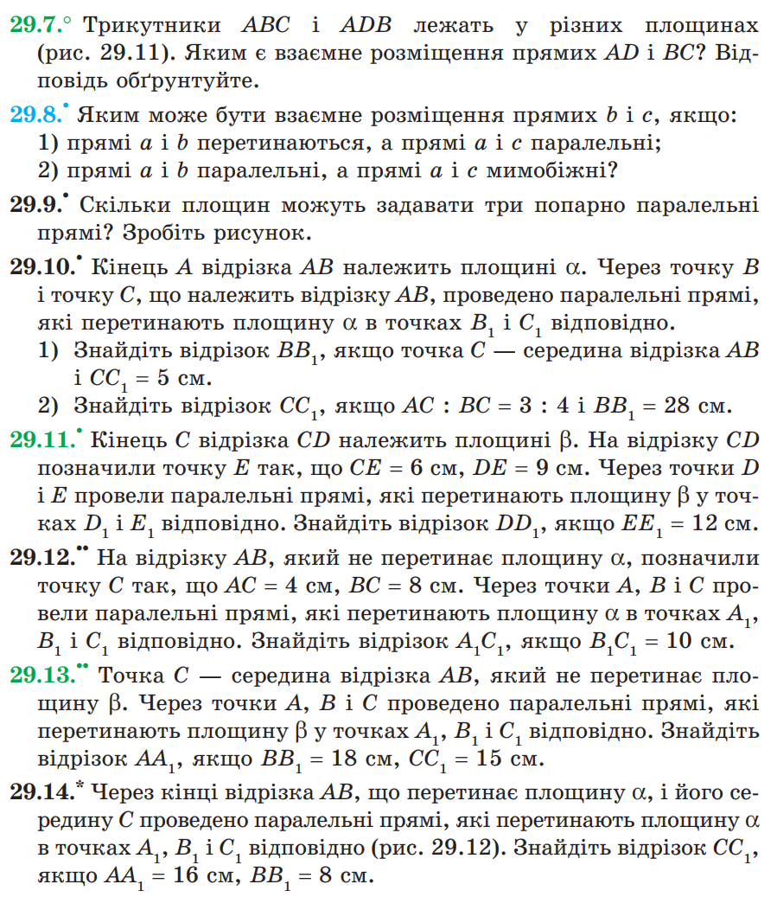

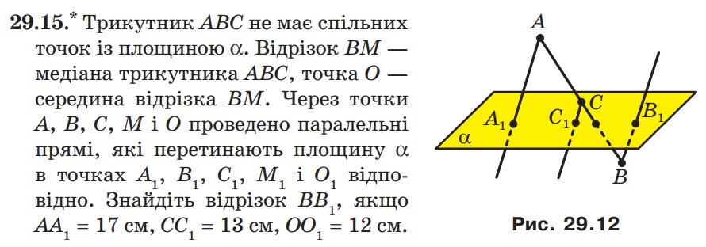

### Паралельність прямої та площини

Задачі: 30.2 та 30.3

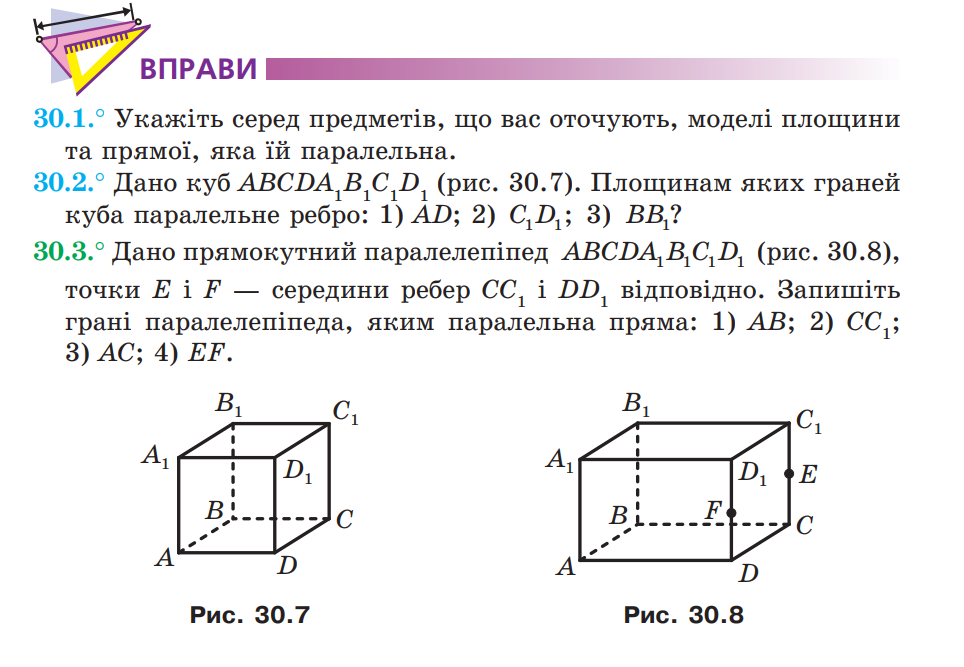

Задачі: 30.4, 30.5, 30.8, 30.9

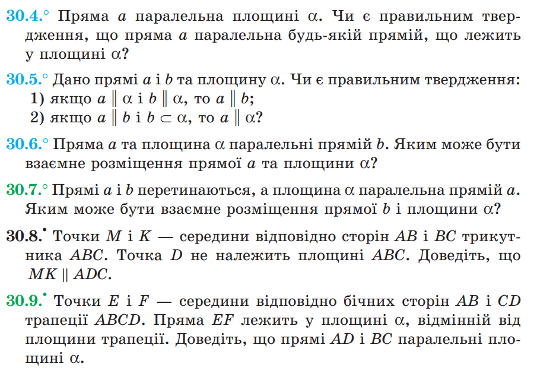

Задачі: 30.10, 30.11, 30.12

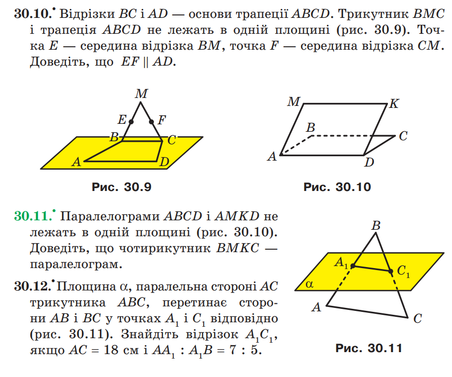

Задачі: 30.13 та 30.15

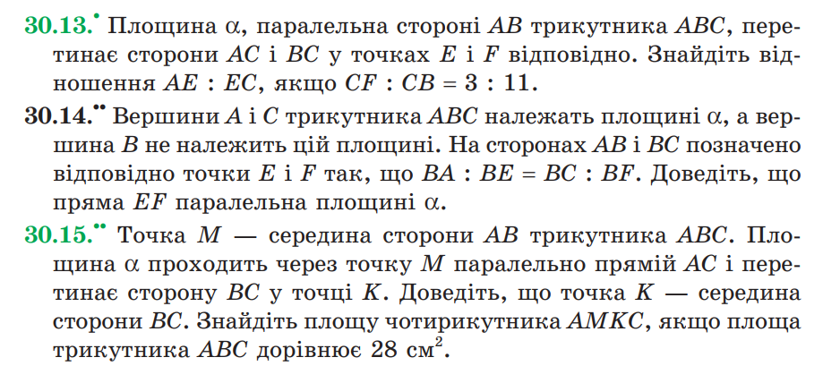

### Паралельність площин

Задачі: 31.5, 31.6

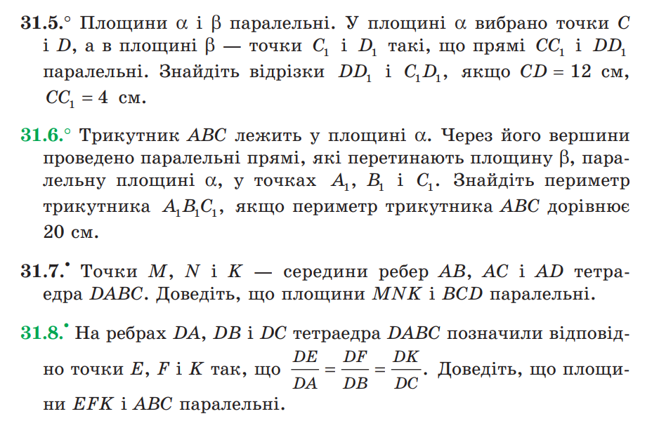

Задачі: 31.11, 31.12

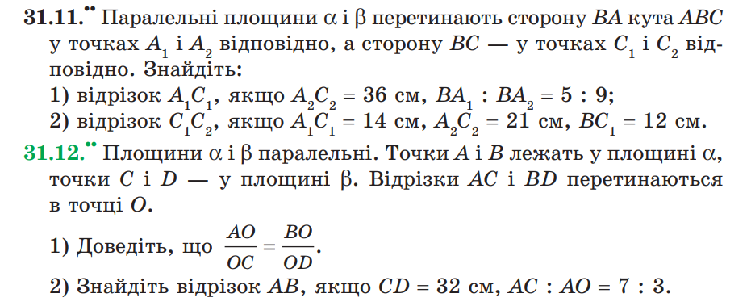