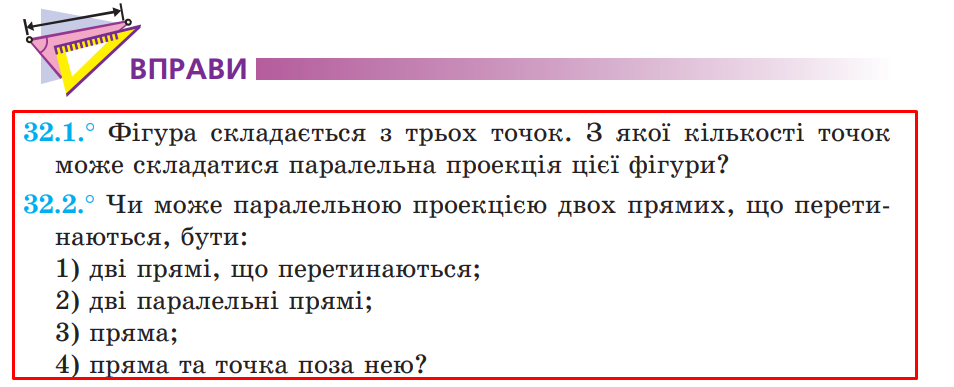
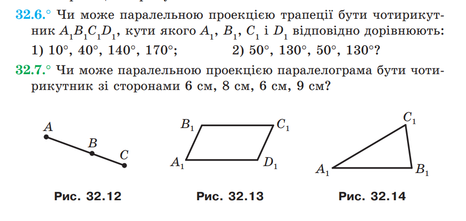
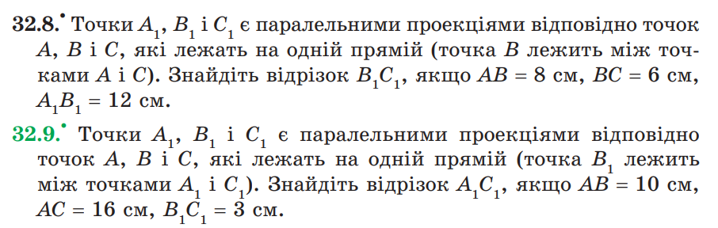

---
puppeteer:
  format: 'A4'
  margin:
    top: '1cm'
    right: '1cm'
    bottom: '1cm'
    left: '1cm'
  landscape: false
---

# Математика Задачі 2 курс 1 семестр

## Паралельне проектування і його властивості. Зображення фігур у стереометрії

