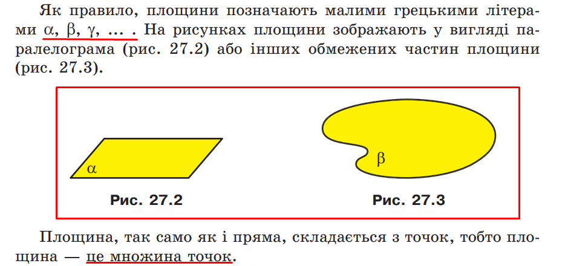
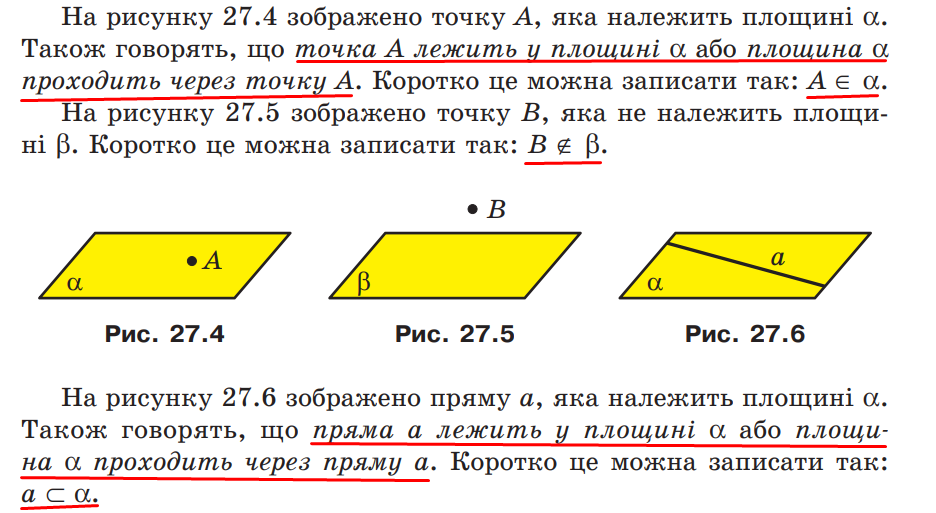
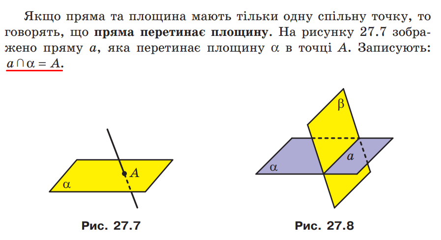
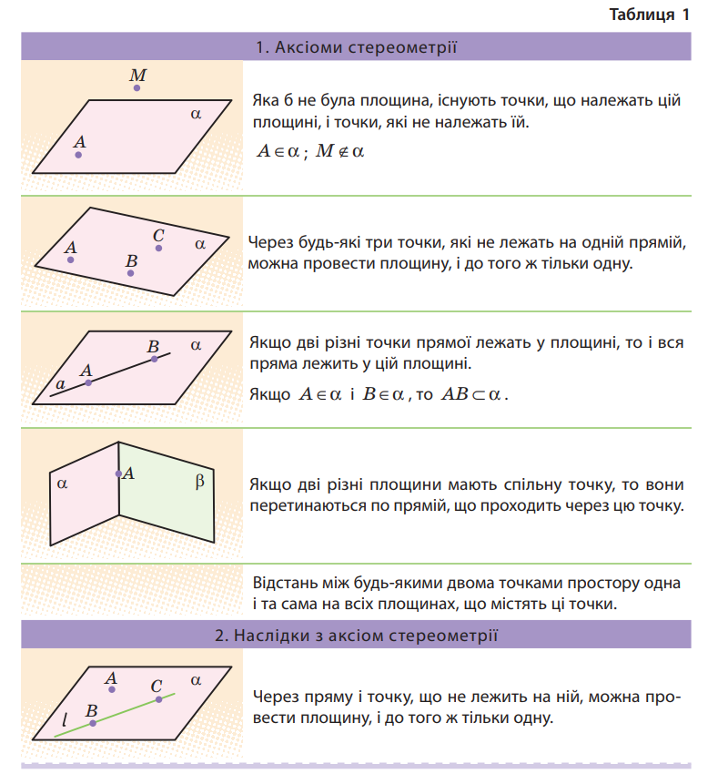
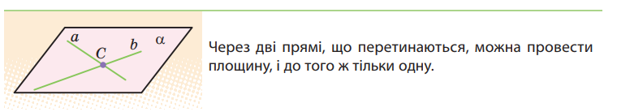
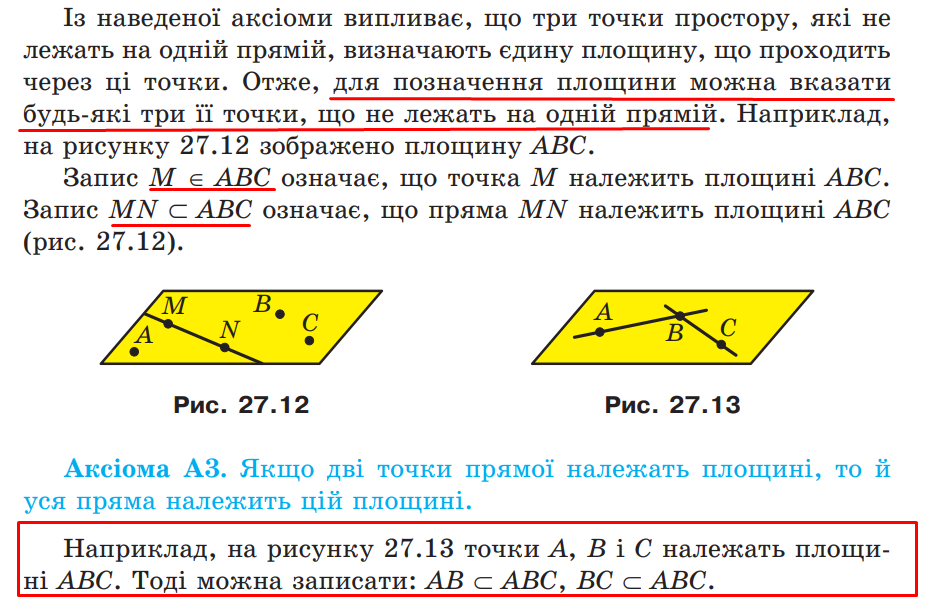
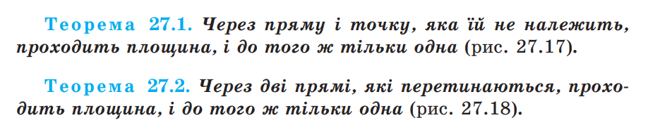
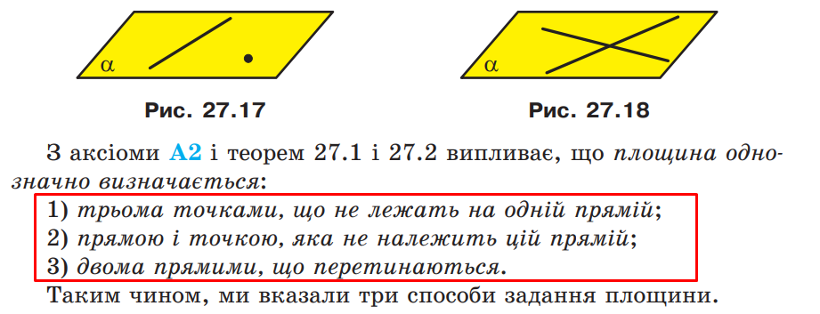

---
puppeteer:
  format: 'A4'
  margin:
    top: '1cm'
    right: '1cm'
    bottom: '1cm'
    left: '1cm'
  landscape: false
---

# Математика 2 курс 1 семестр

## Основні поняття, аксіоми стереометрії та найпростіші наслідки з них

## Взаємне розміщення прямих у просторі. Паралельність прямої та площини. Паралельність площин

## Паралельне проектування і його властивості. Зображення фігур у стереометрії