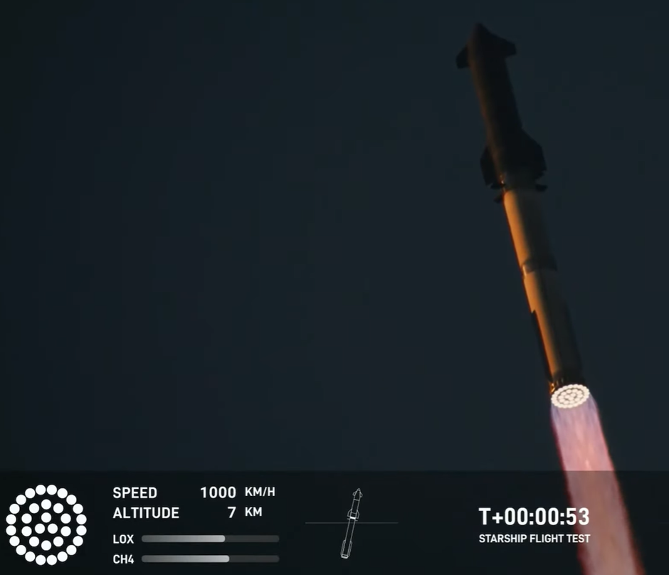
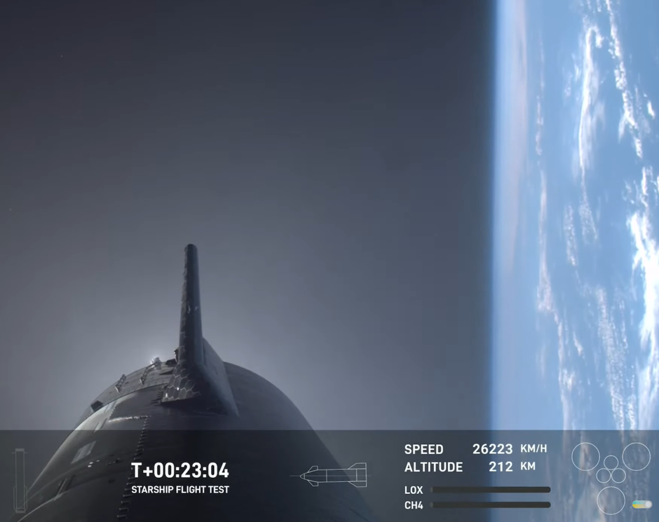
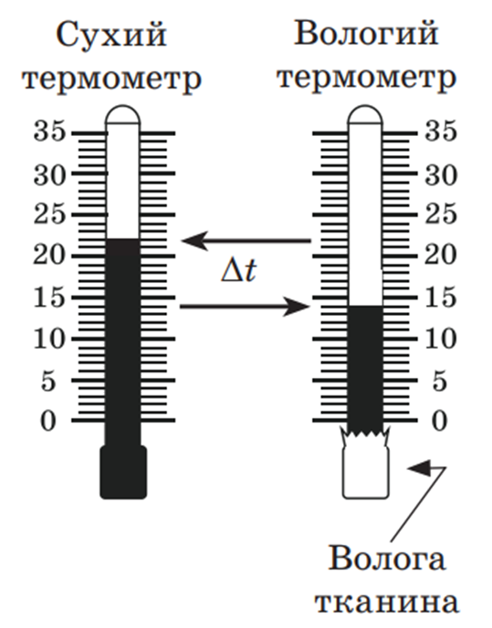
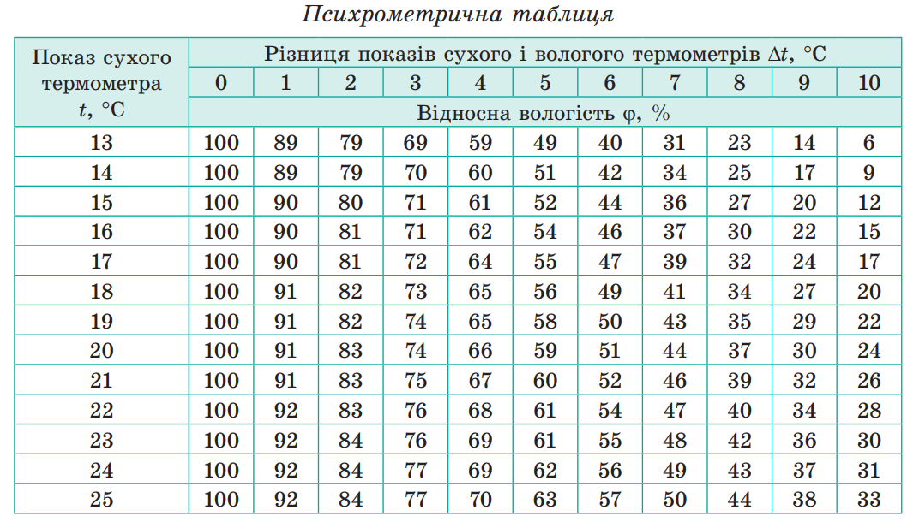
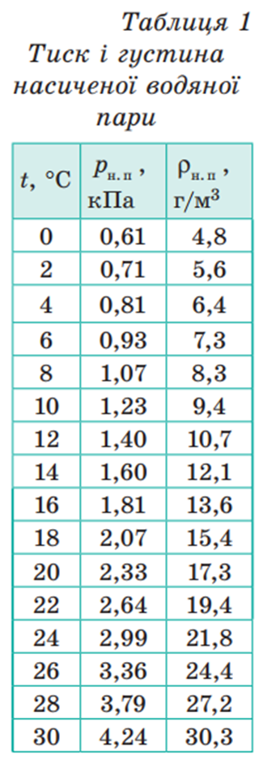

## Домашнє завдання 1

**Теоретичний матеріал**:
- Підручник Бар'яхтар 10 клас рівень стандарту: параграфи 4-6
- https://yakovliev.github.io/quantopia-school-ua/physics/mechanics/kinematics-01.html
- https://yakovliev.github.io/quantopia-school-ua/physics/mechanics/kinematics-02.html
- https://yakovliev.github.io/quantopia-school-ua/physics/mechanics/kinematics-03.html

**Завдання 1**:
- Записати наступні означення/формули в конспект: матеріальна точка, шлях, переміщення, закон додавання швидкостей (принцип відносності Галілея)

Якщо вищевказані означення/формули уже були записані в конспект під час пари, повторно можете їх не записувати. Означення/формули можете брати із підручника або інших джерел.

---

## Домашнє завдання 2

**Теоретичний матеріал**:
- Підручник Бар'яхтар 10 клас рівень стандарту: параграфи 4-6
- https://yakovliev.github.io/quantopia-school-ua/physics/mechanics/kinematics-01.html
- https://yakovliev.github.io/quantopia-school-ua/physics/mechanics/kinematics-02.html
- https://yakovliev.github.io/quantopia-school-ua/physics/mechanics/kinematics-03.html

**Завдання 1**:
- Записати наступні означення/формули в конспект: миттєва швидкість, прискорення, рівняння руху (рівняння координати) рівноприскореного прямолінійного руху

Якщо вищевказані означення/формули уже були записані в конспект під час пари, повторно можете їх не записувати. Означення/формули можете брати із підручника або інших джерел.

**Завдання 2**:

Автомобіль рухається по прямій зі швидкістю 120 км/год протягом 20 хв, потім зі швидкістю 80 км/год протягом 30 хв, і, зрештою, зі швидкістю 90 км/год протягом 10 хв. Знайти загальну пройдену відстань (км) та середню швидкість (км/год).

**Завдання 3**:

Розгін автомобіля Tesla Model S Plaid від 0 до 100 км/год відбувається за 2.1 секунди. Припускаємо, що цей рух є рівноприскореним прямолінійним рухом. Вирахувати прискорення (в $м/с^2$) та шлях (в метрах) пройдений під час цього розгону.

---

## Домашнє завдання 3

**Теоретичний матеріал**:
- Підручник Бар'яхтар 10 клас рівень стандарту: параграфи 7 та 8
- https://yakovliev.github.io/quantopia-school-ua/physics/mechanics/kinematics-04.html
- https://yakovliev.github.io/quantopia-school-ua/physics/mechanics/kinematics-05.html

**Завдання 1**:
- Записати наступні означення/формули в конспект: вільне падіння, прискорення вільного падіння, період обертання, обертова частота (або частота обертання), кутова швидкість, доцентрове прискорення та формула для доцентрового прискорення при рівномірному русі по колу.

Якщо вищевказані означення/формули уже були записані в конспект під час пари, повторно можете їх не записувати. Означення/формули можете брати із підручника або інших джерел.

**Завдання 2**:

Тіло кидають вертикально вниз із повітряної кулі з висоти 125 метрів. Початкова швидкість нульова. Прискорення вільного падіння вважати рівним 10 $\text{м}/\text{с}^2$. Розрахувати час падіння тіла та швидкість в момент зіткнення із землею. Опором повітря знехтувати

**Завдання 3**:

Маленький квадрокоптер злітає вертикально вгору з початковою швидкістю 20 м/с. Уявімо, що одразу після старту його двигуни вимкнулись. На яку максимальну висоту він зможе піднятися за інерцією?

**Завдання 4**:

Жорсткий диск (HDD) у ноутбуці обертається зі сталою частотою 4200 обертів за хвилину. Визначте обертову частоту диска в герцах (Гц). Знайдіть період обертання диска.

**Завдання 5**:

Лопать квадрокоптера має довжину 15 см. Під час польоту вона обертається з частотою 120 Гц. Знайдіть лінійну швидкість точки, що знаходиться на самому кінці лопаті.

## Домашнє завдання 4

**Теоретичний матеріал**:
- Підручник Бар'яхтар 10 клас рівень стандарту: параграфи 9, 10, 11
- https://yakovliev.github.io/quantopia-school-ua/physics/mechanics/newton-first-law.html
- https://yakovliev.github.io/quantopia-school-ua/physics/mechanics/kinematics-05.html
- https://yakovliev.github.io/quantopia-school-ua/physics/mechanics/newtons-law-of-universal-gravitation.html

**Завдання 1**:
- Записати наступні означення/формули в конспект: інертність, інерціальна система відліку, неінерціальна система відліку, перший закон Ньютона, другий закон Ньютона, третій закон Ньютона, закон всесвітнього тяжіння

**Завдання 2**:

Визначити прискорення вільного падіння g на висоті 400 км  (приблизно на цій висоті рухається Міжнародна космічна станція) та на висоті 2000 км (це межа між низькою навколоземною орбітою та середньою навколоземною орбітою) над поверхнею Землі.

**Завдання 3**:

13 жовтня 2024 року SpaceX провели п'ятий тестовий політ ракети Starship. Ми можемо дізнатись трішки більше деталей про цей запуск за рахунок застосування тих навичок, які ми вже опанували на парах з фізики. На 53 секунді від початку запуску ракета досягнула швидкості 1000 км/год (див. скріншот). Вважаючи рух рівноприскореним, розрахувати прискорення ракети в $\text{м}/\text{с}^2$. Розрахувати відстань, яку пройшла б ракета із таким прискоренням за ці 53 секунди. Приблизно в момент часу 53 секунди датчики показали висоту, на якій перебувала ракета, як 7 км. Порівняти знайдену відстань та ці 7 км (знайти різницю між цими двома значеннями, результат виразити в метрах).

Скріншот із даними, які були згадані в постановці задачі:

**Завдання 4**:

На 23 хвилині від старту ракети, друга ступінь ракети знаходилась на висоті 212 км і летіла зі швидкістю 26223 км/год (див. скріншот). Треба порахувати першу космічну швидкість на висоті 212 км. Розрахунок потрібно виконати дуже точно, тому використовуйте наступні параметри:
1. Маса Землі становить $5.972 \cdot 10^{24}$ кг
2. Радіус Землі становить 6371 км
Результат округлити до одиниць (не потрібно десятих чи сотих часток км/год записувати).

І наостанок, вказати чи перша космічна швидкість на заданій висоті більша за 26223 км/год чи менша. На основі цього порівняння вкажіть чи політ був орбітальним чи суборбітальним.

Скріншот із даними, які були згадані в постановці задачі:

Посилання на трансляцію тестового запуску (кому цікаво буде глянути): https://www.youtube.com/watch?v=LjpbbvSNNpY

Примітка: найцікавіша (навіть, можна сказати, історична) подія починається із 47 хв запису.

---

## Домашнє завдання 5

**Теоретичний матеріал**:
- Підручник Бар'яхтар 10 клас рівень стандарту: параграфи 15, 16
- https://yakovliev.github.io/quantopia-school-ua/physics/mechanics/work-kinetic-energy.html
- https://yakovliev.github.io/quantopia-school-ua/physics/mechanics/potential-energy-and-conservation.html

**Завдання 1**:
- Записати наступні означення/формули в конспект: механічна робота, енергія, кінетична енергія, потенціальна енергія, теорема про кінетичну енергію, теорема про потенціальну енергію, потужність, консервативні сили, повна механічна енергія, замкнена система тіл, закон збереження повної механічної енергії.

**Завдання 2**:

Яку роботу потрібно виконати, щоб рівномірно підняти вантаж масою 10 кг на висоту 5 м?

**Завдання 3**:

Автомобіль масою 1 т збільшив швидкість свого руху від 10 до 20 м/с. Визначити кінетичну енергію в початковим момент часу, визначити кінетичну енергію в кінцевий момент часу, коли швидкість досягнула значення 20 м/с і визначити роботу рівнодійної сил, які діють на автомобіль.

---

## Домашнє завдання 6

**Теоретичний матеріал**:
- Підручник Бар'яхтар 10 клас рівень стандарту: параграфи 26, 27, 28, 29, 30
- https://yakovliev.github.io/quantopia-school-ua/physics/mkt/fundamentals-of-mkt.html
- https://yakovliev.github.io/quantopia-school-ua/physics/mkt/molecules-interaction.html
- https://yakovliev.github.io/quantopia-school-ua/physics/mkt/basic-equation-of-ideal-gas.html
- https://yakovliev.github.io/quantopia-school-ua/physics/mkt/temperature-basics.html
- https://yakovliev.github.io/quantopia-school-ua/physics/mkt/ideal-gas-law.html

**Завдання 1**:
- Записати наступні означення/формули в конспект: атомна одиниця маси, відносна атомна маса, відносна молекулярна маса, моль, число Авогадро, кількість речовини, молярна маса, ідеальний газ

**Завдання 2**:

Скільки молекул та скільки молів міститься у воді об’ємом 2.0 л?

Примітка: спочатку об’єм необхідно перевести в масу (густина води дорівнює 1000 кг/м$^3$).

**Завдання 3**:

На висоті орбіти Міжнародної космічної станції (МКС) залишкові частинки атмосфери (переважно атомарний кисень) сильно іонізовані сонячним випромінюванням, тому їхня середня кінетична енергія досить висока - близько $1.2 \cdot 10^{-19}$ Дж. Тиск, який створюють ці частинки, надзвичайно низький - приблизно $1 \cdot 10^{-9}$ Па. Середня маса частинки становить $2.66 \cdot 10^{-26}$ кг (атом кисню).
1.  Знайдіть концентрацію частинок на цій висоті.
2.  Обчисліть густину залишкової атмосфери на висоті орбіти МКС.
3.  Визначте середню квадратичну швидкість цих частинок. Порівняйте її зі швидкістю руху самої МКС (близько 7.7 км/с).

**Завдання 4**:

У лабораторії для 3D-друку використовують балон зі стисненим азотом (N₂) для створення інертної атмосфери. Балон має об'єм 50 літрів і витримує максимальний тиск 20 МПа. Яку максимальну масу азоту можна закачати в цей балон при температурі 25°C, не перевищуючи допустимий тиск? Молярна маса азоту становить 0.028 кг/моль.

---

## Домашнє завдання 7

**Теоретичний матеріал**:
- Підручник Бар'яхтар 10 клас рівень стандарту: параграфи 31, 32, 33, 34
- https://yakovliev.github.io/quantopia-school-ua/physics/mkt/evaporation-and-condensation.html
- https://yakovliev.github.io/quantopia-school-ua/physics/mkt/humidity.html

**Завдання 1**:
- Записати наступні означення/формули в конспект: пароутворення, конденсація, випаровування, насичена пара та ненасичена пара, кипіння, вологість повітря, абсолютна вологість, відносна вологість, точка роси.

**Завдання 2**:

1. Визначіть покази термометрів із рисунка та запишіть їх в зошиті у якості вхідних/початкових умов:

2. На основі психрометричної таблиці визначіть, яка відносна вологість повітря при таких показах сухого та вологого термометрів

3. Визначіть, якою є абсолютна вологість повітря (порахуйте по формулі).

4. За умови, що визначена вам абсолютна вологість повітря не змінюється, а температура зменшилась до 14 градусів Цельсія, визначіть нове значення відносної вологості. Для цього знадобиться формула та наступна таблиця:

---

## Домашнє завдання 8

**Теоретичний матеріал**:
- Підручник Бар'яхтар 10 клас рівень стандарту: параграфи 40, 41, 42, 43, 44
- https://yakovliev.github.io/quantopia-school-ua/physics/electrodynamics/charge_01.html
- https://yakovliev.github.io/quantopia-school-ua/physics/electrodynamics/charge_02.html
- https://yakovliev.github.io/quantopia-school-ua/physics/electrodynamics/electric_current.html

**Завдання 1**:
- Записати наступні означення/формули в конспект: елементарний електричний заряд, закон Кулона, напруженість електричного поля, сила струму, напруга, опір, закон Ома для ділянки кола

**Завдання 2**:

Знайти силу взаємодії між двома зарядами $5 \cdot 10^{-15}$ Кл та $-3 \cdot 10^{-14}$ Кл, якщо відстань між ними складає:
а) 3 метри
б) 6 мм

**Завдання 3**:

У вакуумі знаходяться два точкові заряди: $q_1$ = +2 нКл та $q_2$ = -3 нКл на відстані 20 см один від одного. Визначте напруженість електричного поля в точці, що знаходиться на відрізку, який з'єднує заряди, на відстані 5 см від позитивного заряду $q_1$. Відповідь запишіть в В/м.

---

## Домашнє завдання 9

**Теоретичний матеріал**:
- Підручник Бар'яхтар 11 клас рівень стандарту: параграфи 1, 2, 3, 4
- https://yakovliev.github.io/quantopia-school-ua/physics/electrodynamics/electric_current.html
- https://yakovliev.github.io/quantopia-school-ua/physics/electrodynamics/series_and_parallel_connection.html
- https://yakovliev.github.io/quantopia-school-ua/physics/electrodynamics/work_power_electric_current.html
- https://yakovliev.github.io/quantopia-school-ua/physics/electrodynamics/electromotive_force.html

**Завдання 1**:
- Записати наступні означення/формули в конспект: робота постійного струму, потужність електричного струму, закон Джоуля-Ленца, закон Ома для повного кола

**Завдання 2**:

В однорідному електростатичному полі напруженістю E = 200 В/м позитивний заряд q = 5×10⁻⁶ Кл переміщується з точки А в точку В на відстань 40 см. Кут між вектором напруженості поля і напрямком переміщення становить 60°. Визначте роботу сил поля при переміщенні заряду.

**Завдання 3**:

У лабораторній роботі учень з'єднав послідовно три резистори з опорами R₁ = 5 Ом, R₂ = 10 Ом та R₃ = 15 Ом. До цієї ділянки кола він приклав напругу 60 В.
Визначте:
1.	Загальний опір такого з'єднання.
2.	Силу струму, що проходить через кожен резистор.
3.	Напругу на кожному з резисторів.
4.	Побудуйте відповідну електричну схему.

**Завдання 4**:

В електричному колі три резистори з'єднані наступним чином: два резистори R₁ = 8 Ом та R₂ = 12 Ом з'єднані паралельно між собою, а резистор R₃ = 6 Ом з'єднаний послідовно з цим паралельним блоком. До всього кола прикладено напругу 36 В.
Визначте:
1.	Загальний опір такого з'єднання.
2.	Силу струму, що проходить через кожен резистор.
3.	Напругу на кожному з резисторів.
4.	Яка частка загальної потужності виділяється на резисторі R₃?
