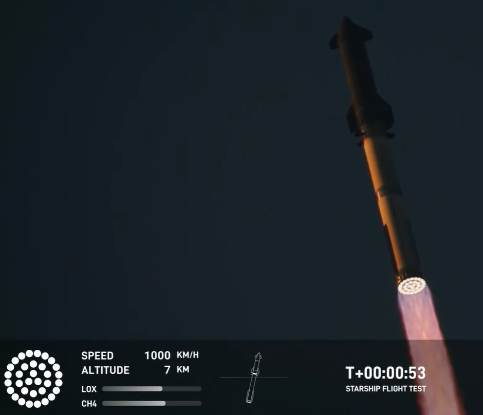

## Домашнє завдання 1

**Теоретичний матеріал**:
- Підручник Бар'яхтар 10 клас рівень стандарту: параграфи 4-6
- https://yakovliev.github.io/quantopia-school-ua/physics/mechanics/kinematics-01.html
- https://yakovliev.github.io/quantopia-school-ua/physics/mechanics/kinematics-02.html
- https://yakovliev.github.io/quantopia-school-ua/physics/mechanics/kinematics-03.html

**Завдання 1**:
- Записати наступні означення/формули в конспект: матеріальна точка, шлях, переміщення, закон додавання швидкостей (принцип відносності Галілея)

Якщо вищевказані означення/формули уже були записані в конспект під час пари, повторно можете їх не записувати. Означення/формули можете брати із підручника або інших джерел.

---

## Домашнє завдання 2

**Теоретичний матеріал**:
- Підручник Бар'яхтар 10 клас рівень стандарту: параграфи 4-6
- https://yakovliev.github.io/quantopia-school-ua/physics/mechanics/kinematics-01.html
- https://yakovliev.github.io/quantopia-school-ua/physics/mechanics/kinematics-02.html
- https://yakovliev.github.io/quantopia-school-ua/physics/mechanics/kinematics-03.html

**Завдання 1**:
- Записати наступні означення/формули в конспект: миттєва швидкість, прискорення, рівняння руху (рівняння координати) рівноприскореного прямолінійного руху

Якщо вищевказані означення/формули уже були записані в конспект під час пари, повторно можете їх не записувати. Означення/формули можете брати із підручника або інших джерел.

**Завдання 2**:

Автомобіль рухається по прямій зі швидкістю 120 км/год протягом 20 хв, потім зі швидкістю 80 км/год протягом 30 хв, і, зрештою, зі швидкістю 90 км/год протягом 10 хв. Знайти загальну пройдену відстань (км) та середню швидкість (км/год).

**Завдання 3**:

Розгін автомобіля Tesla Model S Plaid від 0 до 100 км/год відбувається за 2.1 секунди. Припускаємо, що цей рух є рівноприскореним прямолінійним рухом. Вирахувати прискорення (в $м/с^2$) та шлях (в метрах) пройдений під час цього розгону.

---

## Домашнє завдання 3

**Теоретичний матеріал**:
- Підручник Бар'яхтар 10 клас рівень стандарту: параграф 7
- https://yakovliev.github.io/quantopia-school-ua/physics/mechanics/kinematics-04.html

**Завдання 1**:
- Записати наступні означення/формули в конспект: вільне падіння, прискорення вільного падіння

Якщо вищевказані означення/формули уже були записані в конспект під час пари, повторно можете їх не записувати. Означення/формули можете брати із підручника або інших джерел.

**Завдання 2**:

Тіло кидають вертикально вниз із повітряної кулі з висоти 125 метрів. Початкова швидкість нульова. Прискорення вільного падіння вважати рівним 10 $\text{м}/\text{с}^2$. Розрахувати час падіння тіла та швидкість в момент зіткнення із землею. Опором повітря знехтувати

**Завдання 3**:

Маленький квадрокоптер злітає вертикально вгору з початковою швидкістю 20 м/с. Уявімо, що одразу після старту його двигуни вимкнулись. На яку максимальну висоту він зможе піднятися за інерцією?

## Домашнє завдання 4

**Теоретичний матеріал**:
- Підручник Бар'яхтар 10 клас рівень стандарту: параграф 8
- https://yakovliev.github.io/quantopia-school-ua/physics/mechanics/kinematics-05.html

**Завдання 1**:
- Записати наступні означення/формули в конспект: період обертання, обертова частота (або частота обертання), кутова швидкість, доцентрове прискорення та формула для доцентрового прискорення при рівномірному русі по колу.

Якщо вищевказані означення/формули уже були записані в конспект під час пари, повторно можете їх не записувати. Означення/формули можете брати із підручника або інших джерел.

**Завдання 2**:

Жорсткий диск (HDD) у ноутбуці обертається зі сталою частотою 4200 обертів за хвилину. Визначте обертову частоту диска в герцах (Гц). Знайдіть період обертання диска.

**Завдання 3**:

Лопать квадрокоптера має довжину 15 см. Під час польоту вона обертається з частотою 120 Гц. Знайдіть лінійну швидкість точки, що знаходиться на самому кінці лопаті.

## Домашнє завдання 5

**Теоретичний матеріал**:
- Підручник Бар'яхтар 10 клас рівень стандарту: параграфи 9, 10, 11
- https://yakovliev.github.io/quantopia-school-ua/physics/mechanics/newton-first-law.html
- https://yakovliev.github.io/quantopia-school-ua/physics/mechanics/kinematics-05.html
- https://yakovliev.github.io/quantopia-school-ua/physics/mechanics/newtons-law-of-universal-gravitation.html

**Завдання 1**:
- Записати наступні означення/формули в конспект: інертність, інерціальна система відліку, неінерціальна система відліку, перший закон Ньютона, другий закон Ньютона, третій закон Ньютона, закон всесвітнього тяжіння

Якщо вищевказані означення/формули уже були записані в конспект під час пари, повторно можете їх не записувати. Означення/формули можете брати із підручника або інших джерел.

**Завдання 2**:

13 жовтня 2024 року SpaceX провели п'ятий тестовий політ ракети Starship. Ми можемо дізнатись трішки більше деталей про цей запуск за рахунок застосування тих навичок, які ми вже опанували на парах з фізики. На 53 секунді від початку запуску ракета досягнула швидкості 1000 км/год (див. скріншот). Вважаючи рух рівноприскореним, розрахувати прискорення ракети в $\text{м}/\text{с}^2$. Розрахувати відстань, яку пройшла б ракета із таким прискоренням за ці 53 секунди. Приблизно в момент часу 53 секунди датчики показали висоту, на якій перебувала ракета, як 7 км. Порівняти знайдену відстань та ці 7 км (знайти різницю між цими двома значеннями, результат виразити в метрах).

Скріншот із даними, які були згадані в постановці задачі:

**Завдання 3**:

На 23 хвилині від старту ракети, друга ступінь ракети знаходилась на висоті 212 км і летіла зі швидкістю 26223 км/год (див. скріншот). Треба порахувати першу космічну швидкість на висоті 212 км. Розрахунок потрібно виконати дуже точно, тому використовуйте наступні параметри:
1. Маса Землі становить $5.972 \cdot 10^{24}$ кг
2. Радіус Землі становить 6371 км
Результат округлити до одиниць (не потрібно десятих чи сотих часток км/год записувати).

І наостанок, вказати чи перша космічна швидкість на заданій висоті більша за 26223 км/год чи менша. На основі цього порівняння вкажіть чи політ був орбітальним чи суборбітальним.

Скріншот із даними, які були згадані в постановці задачі:

Посилання на трансляцію тестового запуску (кому цікаво буде глянути): https://www.youtube.com/watch?v=LjpbbvSNNpY

Примітка: найцікавіша (навіть, можна сказати, історична) подія починається із 47 хв запису.

---

## Домашнє завдання 6

**Теоретичний матеріал**:
- Підручник Бар'яхтар 10 клас рівень стандарту: параграф 26
- https://yakovliev.github.io/quantopia-school-ua/physics/mkt/fundamentals-of-mkt.html

**Завдання 1**:
- Записати наступні означення/формули в конспект: атомна одиниця маси, відносна атомна маса, відносна молекулярна маса, моль, число Авогадро, кількість речовини, молярна маса.

Якщо вищевказані означення/формули уже були записані в конспект під час пари, повторно можете їх не записувати. Означення/формули можете брати із підручника або інших джерел.

**Завдання 2**:

Скільки молекул та скільки молів міститься у воді об’ємом 2.0 л?

Примітка: спочатку об’єм необхідно перевести в масу (густина води дорівнює 1000 кг/м$^3$).

**Завдання 3**:

Кремній (Si) є основою сучасної мікроелектроніки. Для виготовлення одного мікрочипа було використано кристалик чистого кремнію масою 0.084 г.
1. Визначте молярну масу Кремнію, скориставшись періодичною таблицею ($A_r(Si) \approx 28$).
2. Обчисліть, скільки атомів Кремнію міститься в цьому кристалику.
